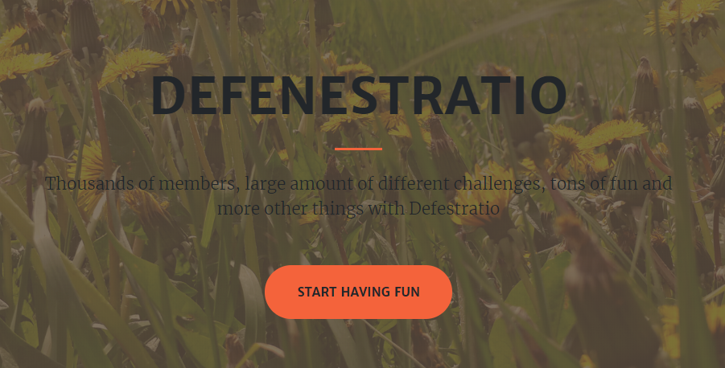
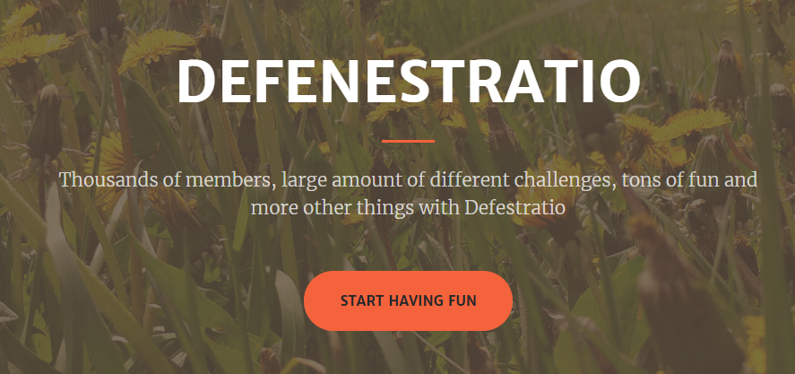
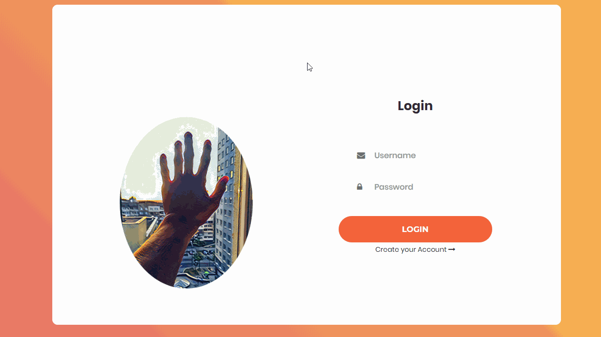
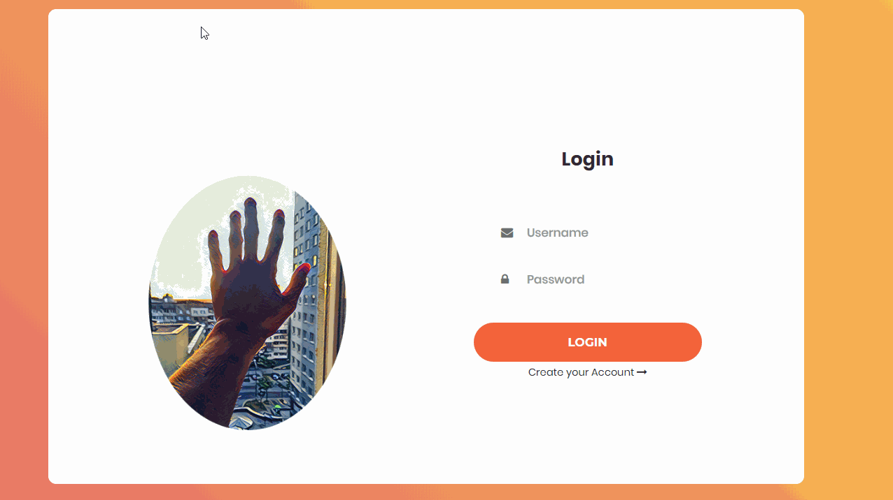
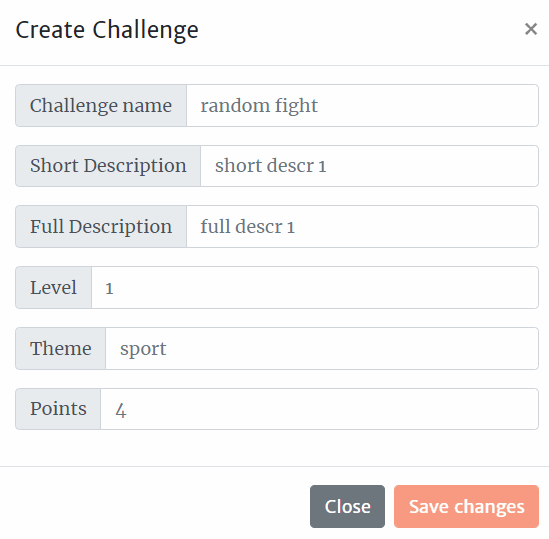
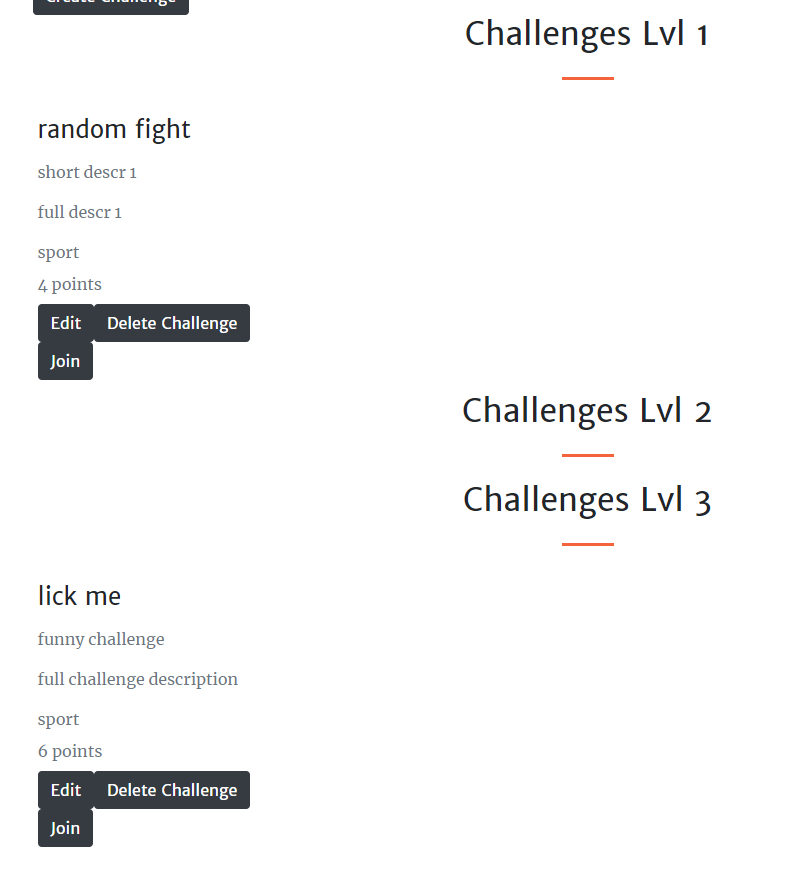
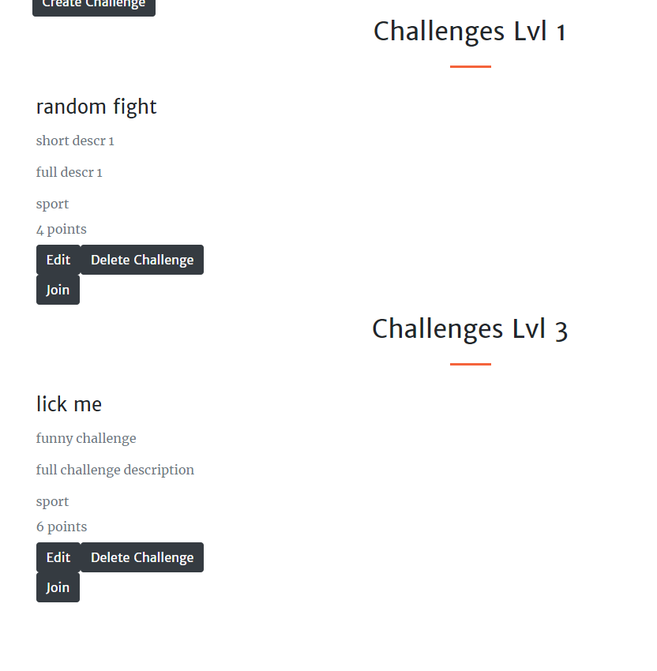
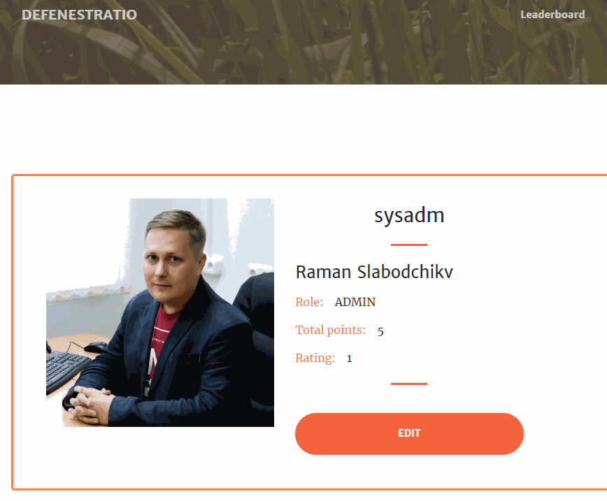

# Оценка текущего состояния ПО

Мы оценили наше ПО по следующим атрибутам качества:
- Распознаваемость соответствия
- Обучаемость
- Используемость
- Защита от ошибок пользователя
- Эстетика GUI
- Доступность

### 1. Распознаваемость соответствия
На данной стадии разработки приложения, пользователь при навигации на главную страницу приложения сразу получает полное представление о назначении приложения. Использование функционала проекта не доставляет неудобства пользователю. Побочные функции, которые не несут полезной нагрузки для приложения, отсутствуют.
### 2. Обучаемость
На данный момент обучаемость функционала высока. Пользователь, который хоть раз выполнял челлендж, сразу сможет изучить весь функционал приложения.
### 3. Используемость
На данный момент пользователь самостоятельно может выбрать тематику челленджей, найти наиболее подходящий для себя вариант, принять челлендж, выполнить его и отправить результаты выполнения на проверку, а также посмотреть таблицу рейтинга и свое место в ней. 
### 4. Защита от ошибок пользователя
Данный атрибут качеста выполняется в большинстве случаев. У пользователя отсутствует возможность ввести пустое имя, фамилию, самостоятельно редактировать свой рейтинг и количество очков, а также отсутствует возможность войти в систему заблокированным пользователям. Но отсутствуют проверки на тип загружаемого файла при отправке результата выполнения челленджа.
### 5. Эстетика GUI
В интерфейсе преобладают белый и персиковые цвета. Все основные страницы приложения имеют схожий привлекательный интерфейс в нейтральных цветах. Все страницы легковесные и быстро загружаются на любых типах устройств и в различных браузерах.
### 6. Доступность
Web-приложение не учитывает особенности пользователей с ограниченными возможностями. Для работы с сайтом ночью или при слабом освещении в будущем планируется реализовать "ночной режим".

# Пути улучшения UX

Наиболее важными на данный момент является улучшения атрибута "Защита от ошибок пользователя" и "Эстетика GUI". Повышение соответствия данным атрибутам будет производиться введением следующих улучшений:

- Если пользователь будет пытаться войти или зарегистрироваться с одним или несколькими пустыми полями, то ему будет выводиться сообщение об этом
- У каждой надписи в приложении будет соответствующий шрифт и стиль

# Результаты

|До|После|Что изменили|
|---|---|---|
|||Исправлены некорректные шрифты|
|||Анимация при выборе поля для ввода|
|||Ошибка при введении пустых полей|
|||Убрана лишняя информация|
|||Автоматическое закрытия формы редактирования профиля|
